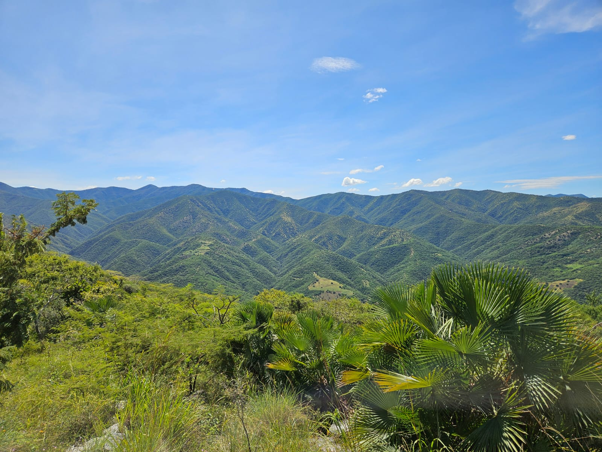

 

This repository contains raw data and R script corresponding to the paper entitled **Acoustic phenology of the dawn chorus in a bird community of a Mexican tropical dry forest** by Rodolfo Javier Flores-Vázquez, Leopoldo Daniel Vázquez-Reyes, Alejandro Martínez-Gordillo and Adolfo Gerardo Navarro Sigüenza, submitted to Journal of Avian Biology. 
  
**Background**  
Acoustic phenology analyses are efficient tools for bird monitoring and conservation, as they enable continuous, non-invasive assessment of temporal variation in vocal activity, which is closely linked to processes such as reproduction and territoriality. These approaches capture changes in community structure and dynamics with high temporal resolution and reduced bias compared to traditional methods. In the Alto Balsas region, high diversity and endemism are driven by its biogeographic position as a transition zone. Additionally, the marked seasonality of tropical dry forests regulates resource availability and species phenology. This dynamic directly shapes the acoustic patterns of bird communities. Therefore, acoustic monitoring allows detection of ecological responses to environmental variability. Overall, it represents a key tool for generating scientific evidence and strengthening conservation strategies. 
  

  

